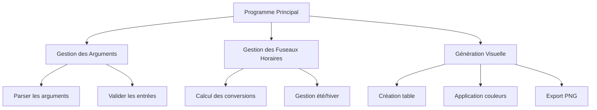
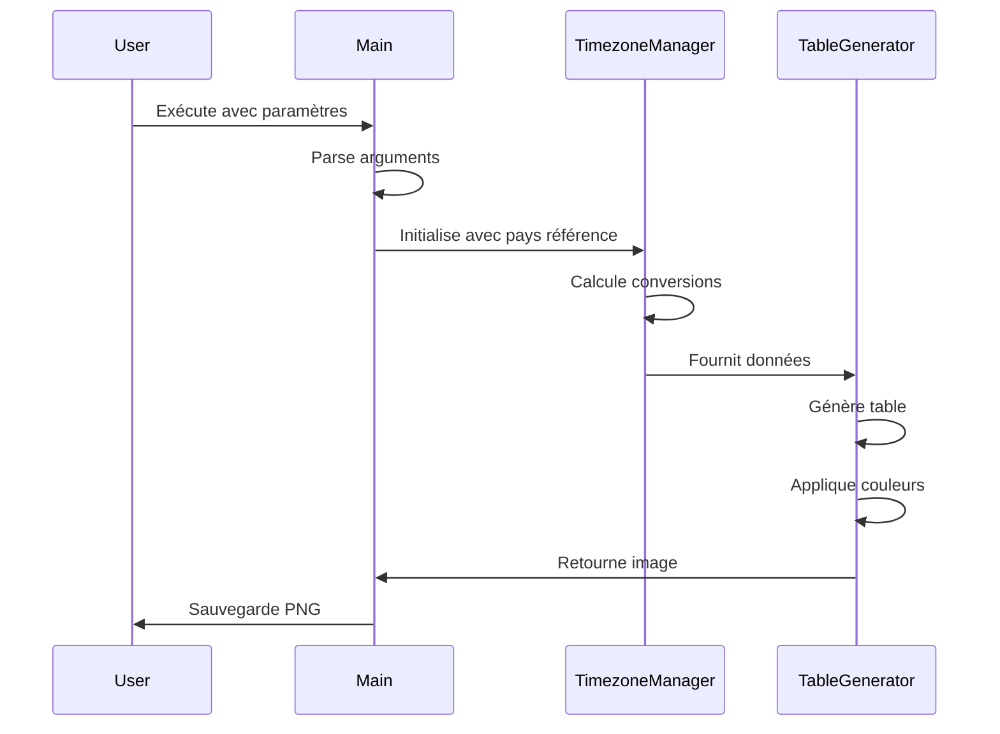

# Plan de Développement - TimeZones Converter

Ce document détaille le plan de développement pour le programme de visualisation des fuseaux horaires.

## 1. Structure du Projet



## 2. Composants Nécessaires

### Modules Python Requis
- `argparse` : Gestion des arguments en ligne de commande
- `pytz` : Gestion des fuseaux horaires
- `datetime` : Manipulation des dates et heures
- `PIL` (Pillow) : Génération de l'image PNG
- `pandas` : Création et manipulation de la table

### Structure des Fichiers
```
timezones/
├── src/
│   ├── __init__.py
│   ├── main.py
│   ├── timezone_manager.py
│   ├── table_generator.py
│   └── utils.py
├── tests/
│   ├── __init__.py
│   └── test_*.py
├── data/
│   └── countries.txt
├── requirements.txt
└── README.md
```

## 3. Flux de Travail



## 4. Étapes de Développement

### Phase 1 : Configuration de Base
- Mise en place de la structure du projet
- Configuration de l'environnement virtuel
- Installation des dépendances

### Phase 2 : Développement Core
- Implémentation du gestionnaire de fuseaux horaires
- Développement du parser d'arguments
- Création des fonctions de conversion

### Phase 3 : Génération Visuelle
- Création du générateur de table
- Implémentation du système de couleurs
- Export en PNG

### Phase 4 : Tests et Documentation
- Écriture des tests unitaires
- Documentation du code
- Exemples d'utilisation

## 5. Points d'Attention

### Gestion des Fuseaux Horaires
- Validation des pays entrés
- Gestion correcte des changements d'heure
- Format 24h pour éviter les ambiguïtés

### Performance
- Optimisation de la génération d'image
- Gestion efficace de la mémoire

### Utilisabilité
- Messages d'erreur clairs
- Validation des entrées utilisateur
- Documentation d'utilisation