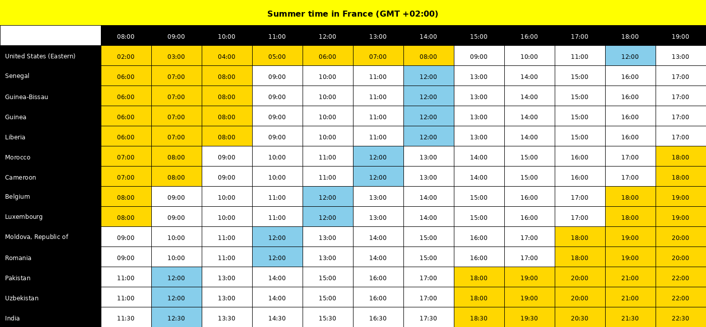

# Timezones
This program generates a visual timetable showing working hours across the different countries relative to a reference country time.

It's particularly useful for teams working across multiple time zones to easily coordinate meetings and collaboration times:



## Features
- Automatically detects winter/summer time for the reference country
- Shows time conversions for working hours (8:00-20:00 French time)
- Color codes different periods of the day:
  - Early/Late hours (before 9:00 or after 18:00)
  - Noon hours (12:00)
  - Normal working hours
- Supports all countries worldwide using ISO 3166-1 alpha-3 codes
- Special support for countries with multiple time zones
- Get reference country from command line parameters
- Generates a clear, easy-to-read table as a PNG file
- You can modify the colors with command line parameters (by default you have early_late_color='#FFD700' (Gold), noon_color='#87CEEB' (Sky Blue) and normal_color='white' (White)

## Installation

1. Make sure you have Python 3.8 or higher installed on your system.

2. Install the required Python packages using pip:
```bash
pip install -r requirements.txt
```

This will install the following dependencies:
- pytz: For timezone handling
- Pillow: For image generation
- pandas: For data manipulation
- pycountry: For worldwide country support and ISO codes

## Usage

1. Create a text file containing the list of countries you want to display using their ISO 3166-1 alpha-3 codes, one per line. For example:
```
# European countries
FRA  # France
ESP  # Spain
GBR  # United Kingdom

# North America
USA-E  # United States (Eastern)
USA-C  # United States (Central)
USA-P  # United States (Pacific)

# Asia
JPN  # Japan
IND  # India
```

2. Run the program with your reference country code and countries file:
```bash
python src/main.py -r "FRA" -c data/countries.txt
```

This will generate a timetable.png file in the current directory.

### Command Line Options

- `-r, --reference`: Reference country code (e.g., "FRA", "USA-E")
- `-c, --countries`: Path to text file containing list of country codes
- `-o, --output`: Output PNG file path (default: timetable.png)
- `--early-late-color`: Color for early/late hours (default: #FFD700 - Gold)
- `--noon-color`: Color for noon hours (default: #87CEEB - Sky Blue)
- `--normal-color`: Color for normal working hours (default: white)

### Multi-Timezone Countries

For countries that span multiple time zones, use these special codes:

#### United States
- USA-E: Eastern Time (New York)
- USA-C: Central Time (Chicago)
- USA-M: Mountain Time (Denver)
- USA-P: Pacific Time (Los Angeles)

#### Russia
- RUS-W: Western Russia (Moscow)
- RUS-C: Central Russia (Yekaterinburg)
- RUS-E: Eastern Russia (Vladivostok)

#### Canada
- CAN-E: Eastern Time (Toronto)
- CAN-C: Central Time (Winnipeg)
- CAN-M: Mountain Time (Edmonton)
- CAN-P: Pacific Time (Vancouver)

#### Brazil
- BRA-E: Eastern Brazil (São Paulo)
- BRA-C: Central Brazil (Manaus)

#### China
- CHN-E: Eastern China (Shanghai)
- CHN-W: Western China (Urumqi)

#### Australia
- AUS-E: Eastern Australia (Sydney)
- AUS-C: Central Australia (Adelaide)
- AUS-W: Western Australia (Perth)

### Examples

1. Using US Eastern Time as reference:
```bash
python src/main.py -r "USA-E" -c data/countries.txt
```

2. Comparing different US time zones:
```bash
# Create a file us_timezones.txt:
USA-E  # Eastern
USA-C  # Central
USA-M  # Mountain
USA-P  # Pacific

# Run the program
python src/main.py -r "USA-E" -c us_timezones.txt
```

3. International business hours:
```bash
# Create a file business.txt:
USA-E  # New York
GBR    # London
FRA    # Paris
IND    # India
JPN    # Japan
AUS-E  # Sydney

# Run the program
python src/main.py -r "FRA" -c business.txt
```

### Notes

- For countries with multiple time zones, use the special codes (e.g., USA-E, RUS-W)
- For other countries, use their standard ISO 3166-1 alpha-3 code
- The program automatically handles daylight saving time (summer/winter time)
- Times are displayed in 24-hour format for clarity
- For time zones with 30-minute offsets (like India), the program correctly displays the actual time including minutes
